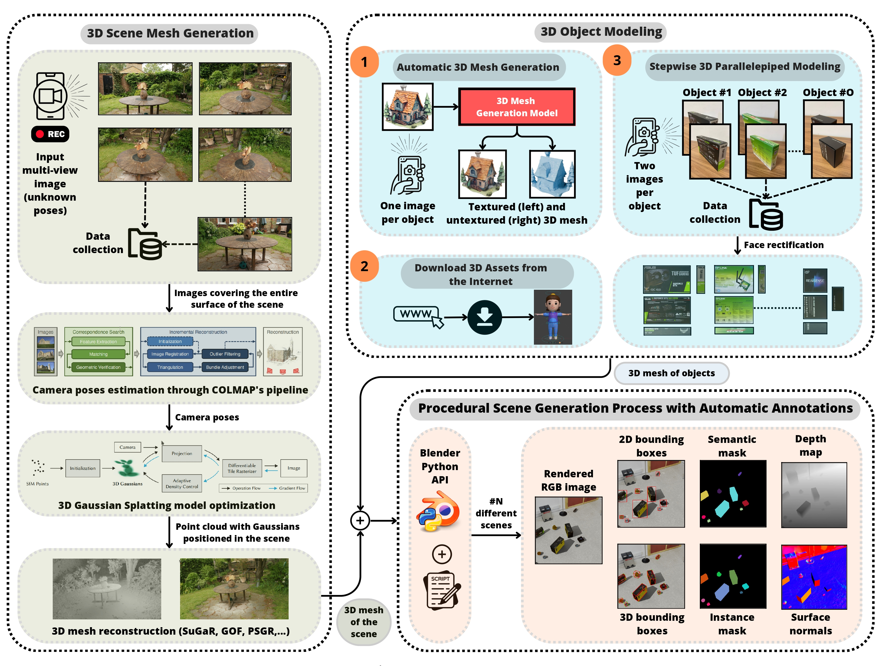
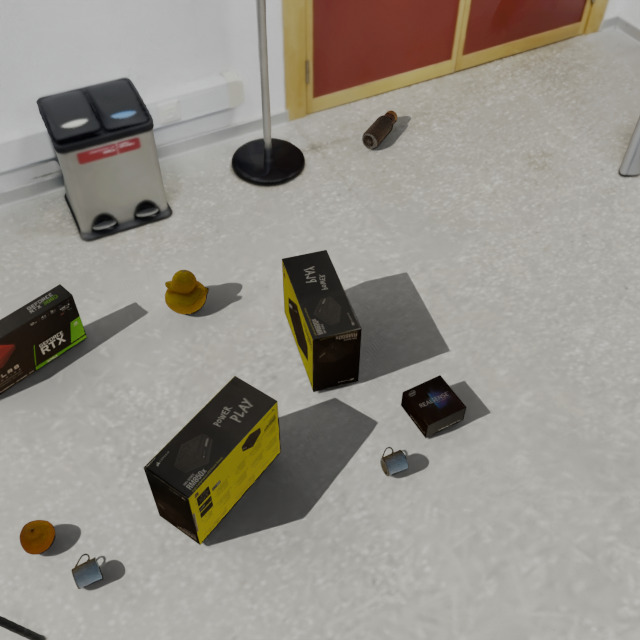
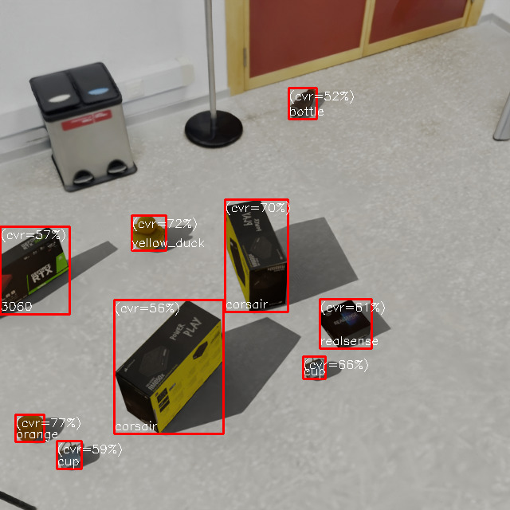
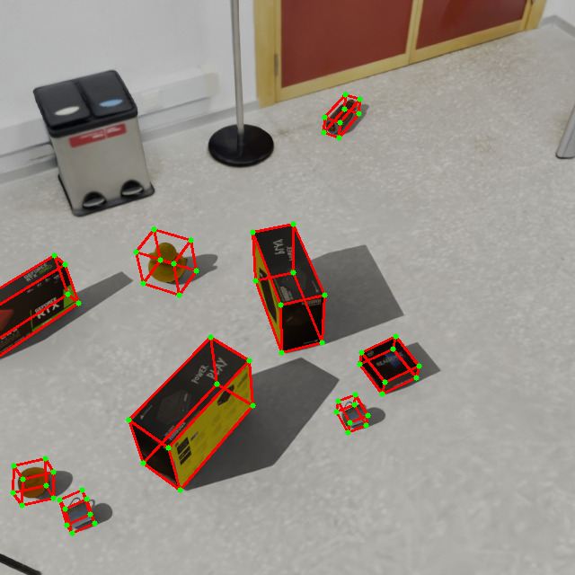
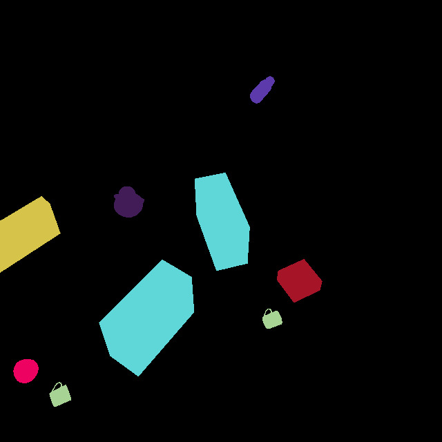
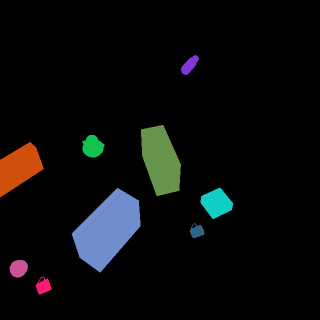
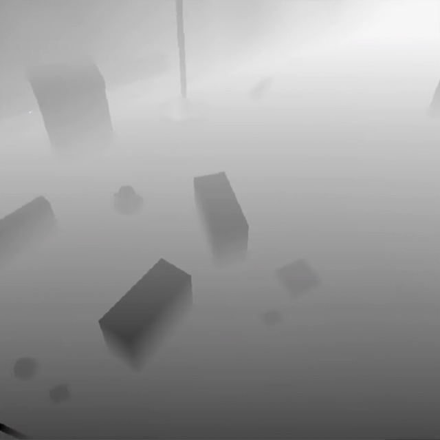
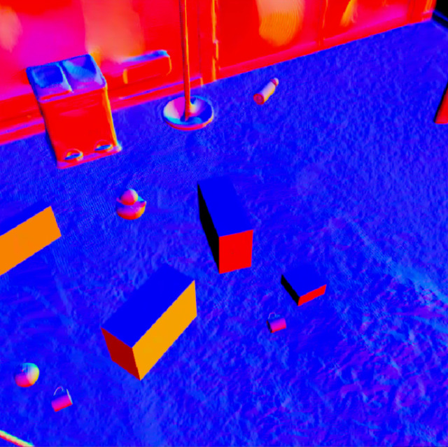

# Blender-Driven High-Quality Synthetic Data & Ground Truth Generation

This repository contains a set of Python scripts for the automatic generation of synthetic scenes in Blender. Advanced techniques for camera positioning, lighting, object selection, and image processing are used to create synthetic datasets with automatic annotations.

---

<div align="center">
<b>Pipeline overview of our methodology to create realistic synthetic data with automatic annotations.</b><br>
<b><code>The code in this repository corresponds to the light orange component in the figure.</code></b><br>
<br>
<b>Example of a synthetic scene and its corresponding automatic annotations, both generated by our approach:</b><br><br>






<br>
</div>

---

## 📌 Main Features
- **Procedural 3D scene generation** with fully parameterized objects for customizable datasets.
- **Dynamic camera positioning**, with constraints on rotation and focal length for realistic viewpoints.
- **Configurable and physically-based lighting** setup, allowing for variable environmental conditions.
- **Automated multi-modal rendering**, including RGB images, depth maps, shading, and normal maps.
- **Ground truth annotation generation** for various computer vision tasks, including:
  - **Object detection** (bounding boxes).
  - **Pose estimation** (3D object orientation and position).
  - **Semantic and instance segmentation** (class and instance masks).
  - **Depth estimation** (pixel-wise depth information).
  - **Normal surface estimation** (surface normals for shape analysis).

---

## 📂 Code Structure
The code is organized into several main files:

<details open>
<summary><span style="font-weight: bold;">Files</span></summary>
<ul>
  <li><code>main_generator.py</code>: Main script for scene generation and pipeline execution.</li>
  <li><code>monitoring_generator.py</code>: Monitors image generation and restarts the process if necessary.</li>
  <li><code>config.py</code>: Configuration management module from a YAML file.</li>
  <li><code>config.yaml</code>: Configuration file with generation parameters.</li>
  <li><code>camera.py</code>: Initialization and configuration of cameras in the scene.</li>
  <li><code>init_scene.py</code>: Initial setup of the scene in Blender.</li>
  <li><code>lighting.py</code>: Light setup and random lighting generation.</li>
  <li><code>objects.py</code>: Object handling and placement in the scene.</li>
  <li><code>pipeline_generator.py</code>: Implementation of the generation and validation pipeline.</li>
  <li><code>rendering.py</code>: Functions for rendering images and depth maps.</li>
  <li><code>utils.py</code>: Auxiliary functions for object manipulation and file management.</li>
</ul>
</details>

---

## 🎯 Configuration File
The `config.yaml` file contains various parameters to customize data generation:
<details open>
<summary><span style="font-weight: bold;">Parameters</span></summary>
<ul>
  <li><code>directory</code>: Path to the object directory.</li>
  <li><code>dictionary_cubes</code>: Path to the cube dictionary.</li>
  <li><code>prism_types</code>: List of prism object types.</li>
  <li><code>num_instances</code>: Number of object instances per scene.</li>
  <li><code>output_dir</code>: Path where generated images are saved.</li>
  <li><code>maxtries</code>: Maximum attempts for object placement.</li>
  <li><code>assets</code>: Path to asset meshes.</li>
  <li><code>min_width_bbox</code>: Minimum bounding box width.</li>
  <li><code>min_height_bbox</code>: Minimum bounding box height.</li>
  <li><code>min_instances_accepted</code>: Minimum number of valid instances per image.</li>
  <li><code>min_box_coverage</code>: Minimum percentage of box coverage required.</li>
  <li><code>img_width</code>: Image width in pixels.</li>
  <li><code>img_height</code>: Image height in pixels.</li>
  <li><code>camera_position</code>: List of predefined camera positions.</li>
  <li><code>camera_rotation_constraints</code>: List of rotation constraints for cameras.</li>
  <li><code>focal_length_constraints</code>: Constraints for focal length variations.</li>
  <li><code>lightning_constraints</code>: Scene lighting constraints.</li>
  <li><code>min_instances</code>: Minimum number of instances required across all images.</li>
  <li><code>total_images</code>: Total number of images to generate.</li>
</ul>
</details>

---

## 🔧 Installation

### Requirements:

- **Blender**: Version 3.x or higher with Python support.
- **Python**: Version 3.x.
- **Additional libraries**: The project relies on several Python libraries.  

**Check the Python scripts in the repository to see all dependencies.**  

> **Note:** The `bpy` library is Blender's Python API and is included with Blender installations.

> Make sure Blender's Python environment is correctly set up to use `bpy`.

---

## 🚀 Quick Start

This project offers two methods for generating synthetic scenes. Choose the method that best fits your needs:


1. **⏩ Continuous execution**: Runs the entire process in one go using `main_generator.py`, generating images until the total image count or minimum instance requirement is met.
2. **🔍 Monitored execution**: Uses `monitoring_generator.py` to periodically restart the process after generating a certain number of images, ensuring stability in long-running tasks.

The continuous method is straightforward, while the monitored method provides more control over long-running generation tasks.

### Steps to get it up and running:

1. **Download scene asset**:
   - Download the required asset from [this link](https://mega.nz/file/CSAARIIC#UfIiE0PrSJIbVxmwTgMsBBKQc6hBOjxWmIsfllfU0DQ).
   - Move the downloaded asset to the `surface/` directory inside the project.

2. **Choose a generation method**:

   - **⏩ Continuous execution**:
     - Run the script:
       ```bash
       python3 main_generator.py --config_file_path config.yaml
       ```

   - **🔍 Monitored execution**:
     - Run the monitoring script with desired parameters:
       ```bash
       python3 monitoring_generator.py --restart_interval 10 --folder_images /path/to/images
       ```
     - Replace `/path/to/images` with the directory where generated images will be stored.
     - The `--restart_interval` parameter specifies how many images should be generated before restarting the process.
       
---

## 🛠️ Work in Progress

The code is currently stable and functional, but we are improving it by refactoring, optimizing, and integrating new functionalities. These updates will be progressively incorporated to boost performance and enhance the synthetic data generation workflow.

---

## 🏗️ Contributions
If you wish to contribute, you can open a *pull request* with improvements to the scripts or documentation.

---

## 📝 License
This project is under the **MIT** license. You are free to use and modify it.

---

## 📩 Contact
If you have questions or suggestions, you can contact me at `juanjesus.losada@um.es`.

---
